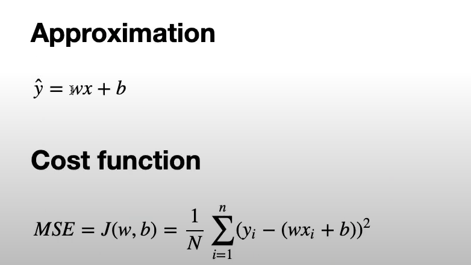
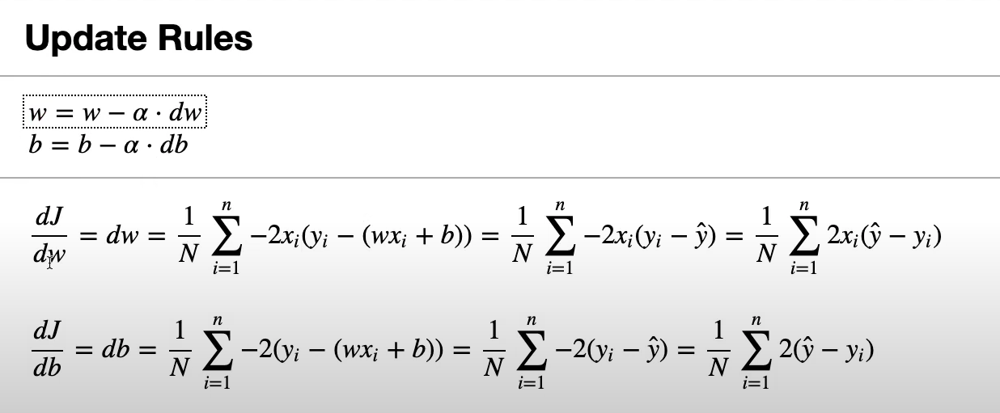

## Linear Regression (from scratch)

### Intuition

Linear regression fits a straight line to predict a continuous target from input features. The model learns weights and a bias that best align predictions with observed values.



### Gradient Updates

Parameters are updated with gradient descent using a learning rate until the loss stops improving.



### Simple Train Loop

1. Compute predictions from the current weights and bias.
2. Compute the mean squared error loss on the batch.
3. Compute gradients with respect to the parameters.
4. Update the parameters with the learning rate.

### Files

- `linear_regression.py`: minimal implementation of the model, loss, gradients, and training loop.
- `linear_regression_test.py`: quick sanity checks and example usage.

### Run

```bash
python3 LinearRegression/linear_regression_test.py
```
