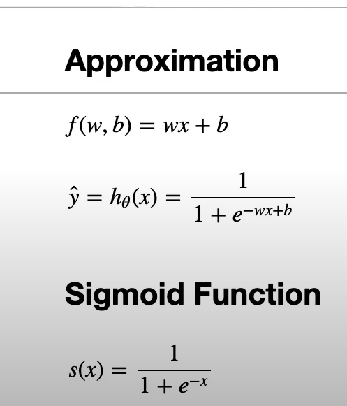
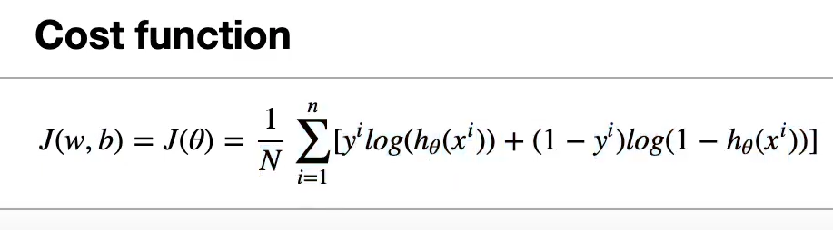
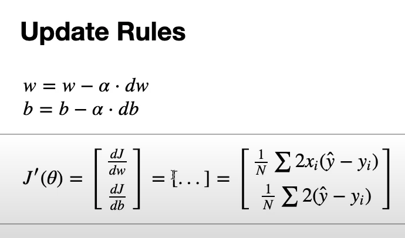

## Logistic Regression (from scratch)

### Intuition

Logistic regression models the probability of a binary outcome. A linear combination of the inputs is passed through a sigmoid to squash the output to the range [0, 1]. You can interpret the result as the probability of the positive class. During training, we adjust the parameters to increase the likelihood of the correct labels.



### Training Objective

We optimize a loss that encourages correct probabilities for the true labels. Lower loss means better-calibrated probabilities and decision boundaries.



### Gradient Updates

Parameters are updated by following the negative gradient of the loss with a learning rate. Repeat over the dataset until the loss stabilizes.



### Simple Train Loop

1. Compute the linear score and apply the sigmoid to get a probability.
2. Compute the loss on the batch.
3. Compute gradients with respect to the parameters.
4. Update the parameters with the learning rate.

### Files

- `logistic_regression.py`: minimal implementation of the model, loss, gradients, and training loop.
- `logistic_regression_test.py`: quick sanity checks and example usage.

### Run

```bash
python3 LogisticRegression/logistic_regression_test.py
```
